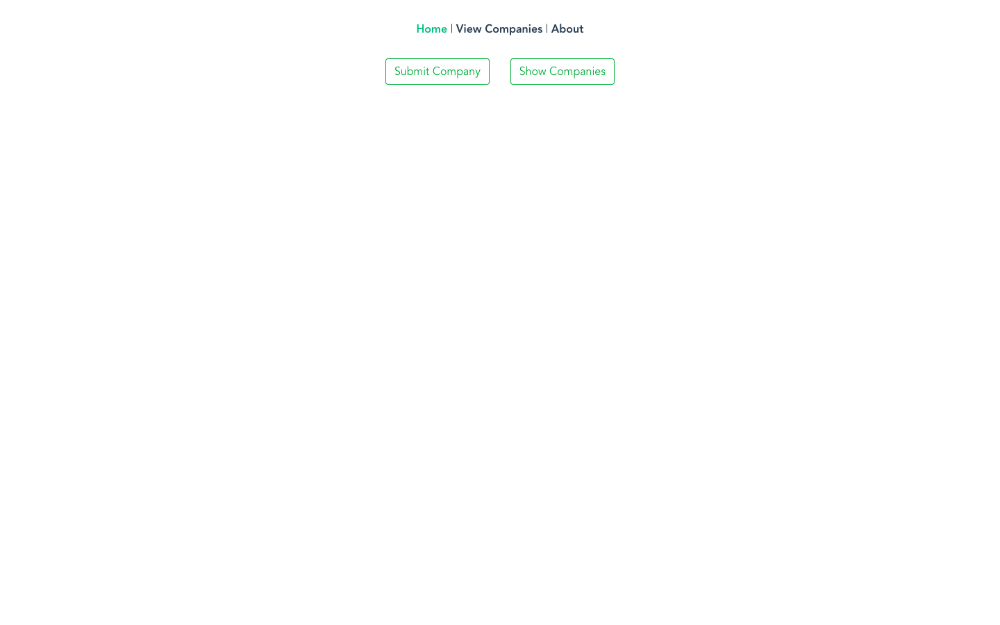
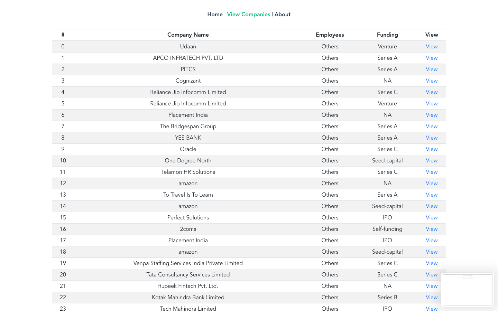
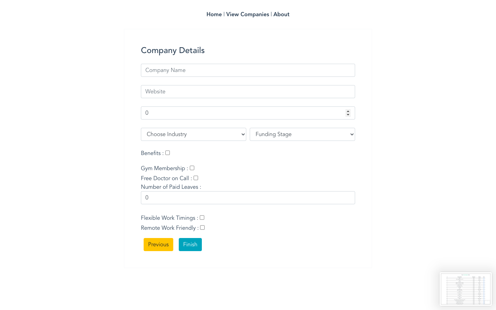
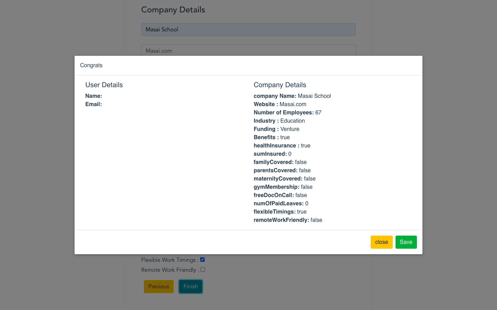
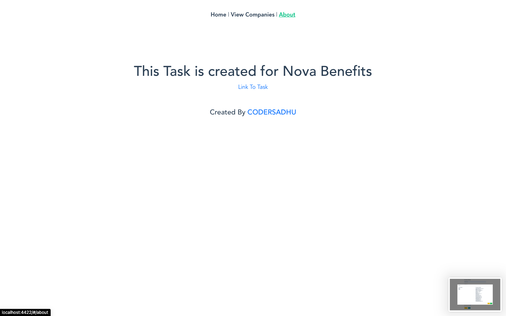
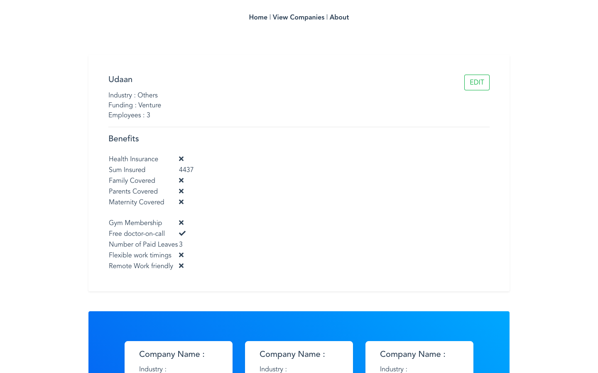
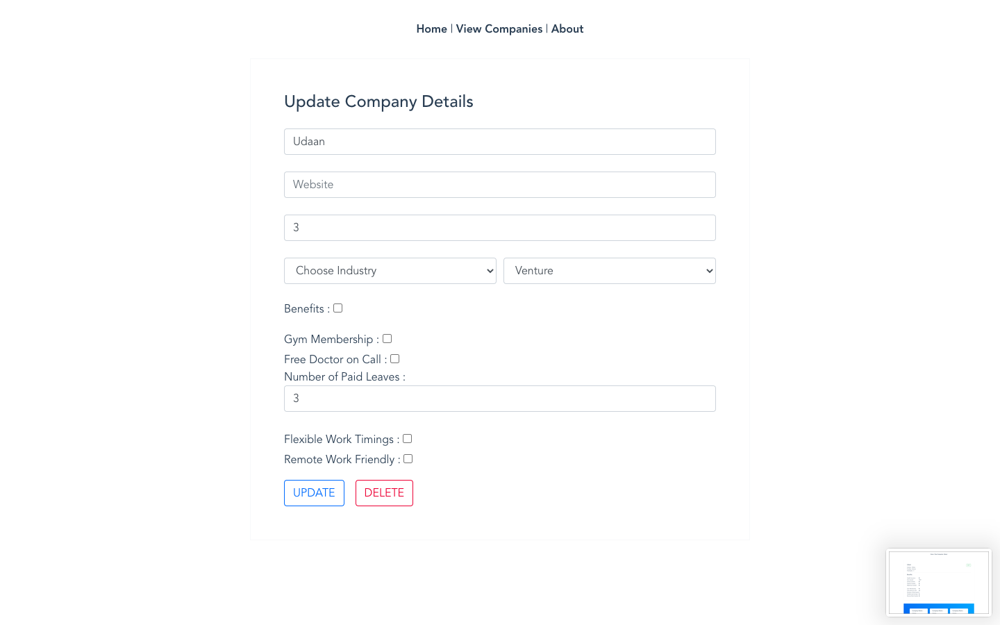

# nova-benefits-task-app

## Problem Statement

Website Comparison app

### Tech / Stack:

- HTML5
- CSS3
- JavaScript
- Bootstrap
- VueJS
- VueX
- Mongo DB
- NodeJS
- ExpressJS

## Banks Screen Mock-up UI :

## My UI :

Step 1 :

Step 2 :
 

Step 3 :
 

Step 4 :
 

 

 

 

 

## Available Scripts

In the project directory, you can run:

### `npm install`

### `npm run start`

Runs the app in the development mode. 
Open [http://localhost:4422](http://localhost:4422) to view it in the browser.

The page will reload if you make edits. 
You will also see any lint errors in the console.

- Truck Tracking System with Realtime API - Remote State
